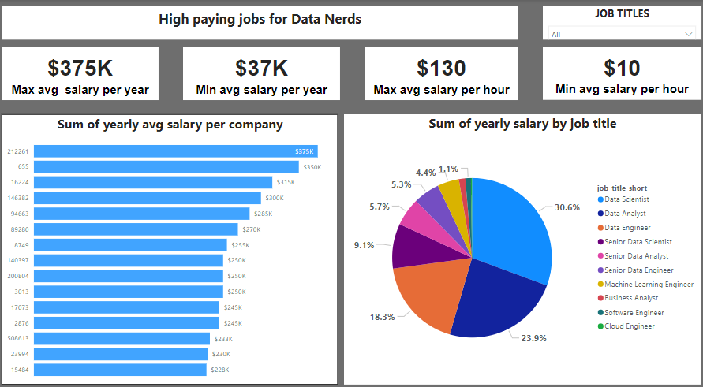
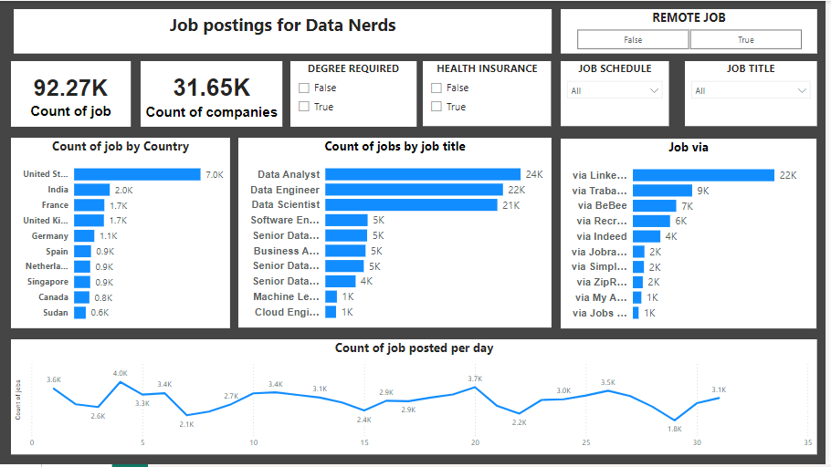

# Data related jobs analysis

## INTRODUCTION: 
This project provides insight on job application and salaries for data related fields such as Data Analysis, Data Engineering, Data Science etc.

## PROBLEM STATEMENT:
-	On an average who earns the most between Data analyst, scientist and engineer.
-	Number of data related job postings 
-	The country with most job postings

## DATA SOURCING: 
-	Downloaded CSV files of data from Linkedln and other job searching sites.
-	Data set contained around 5 to 17 columns and 787,687 to 3,669,604 rows
-	 Column headers include skill_id, job_id, skills, job_id	company_id,	job_title_short,	job_title,	job_location,	job_via, job_schedule_type,
 	job_work_from_home etc.

## SKILL/CONCEPT: 
-	SQL
-	Power BI

## VISUALIZATIONS

## ANALYSIS:
-	 Data analyst are more in demand than any other Data related field
-	Data scientist earn more on an average yearly.
  

## CONCLUSION

This project would be useful to anyone who might be job hunting in these data related field.

